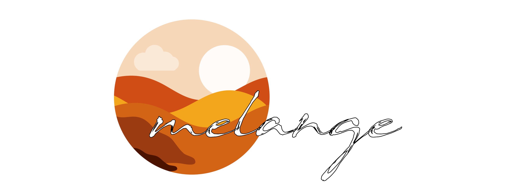

# Melange

## A messaging library for an easy inter-communication in distributed and microservices architectures 

The spice must flow! (or in this case, the events)

Melange offers a flexible, easy-to-use library to create distributed, event-driven architectures using
your preferred messaging infrastructure mechanism.

Out of the box Melange supports the following message brokers as backend infrastructure:

* Amazon's AWS SNS (Simple Notification Service) + SQS (Simple Queue Service).
* RabbitMQ

In addition, Melange supports event driven architectures in single-process, non-distributed, memory-based applications (Console applications, background workers)
with the aid of the `DomainEventBus` (see `Domain-Driven Design` section). The `DomainEventBus` is great if you really 
want to have a clean event-driven architecture with Domain Events, and its idea has been grabbed from Vaughn Vernon and his must-read book 
Implementing Domain-Driven Design (look at [part 3 of these series](http://dddcommunity.org/library/vernon_2011/) if you want a quick look,
 or read this excellent article from [Udi Dahan, founder of NServiceBus](http://udidahan.com/2009/06/14/domain-events-salvation/)).

## Documentation

Full documentation is available at [https://rydra.github.io/melange/](https://rydra.github.io/melange/)

## Examples

The code base features several full-fledged examples that covers some complex use cases:
* Saga choreography in action
* Payment service

## Why the name 'Melange'

The name "Melange" is a reference to the drug-spice from the sci-fi book saga "Dune", a spice which is only 
generated in a single planet in the universe (planet Dune) and every human depends on it.

>If the spice flows, then the spice can be controlled.  
He who controls the spice, controls the universe.  
The spice must flow.

The analogy can be very well made on Events in a distributed architecture :)

## Contributing

## Project Links

* Docs: [https://rydra.github.io/melange](https://rydra.github.io/melange)

## License

MIT licensed. See the bundled [LICENSE](https://github.com/Rydra/melange/blob/master/LICENSE) file for more details.

_Logo <a href="https://www.vecteezy.com/free-vector/nature">Nature Vectors by Vecteezy</a>_
